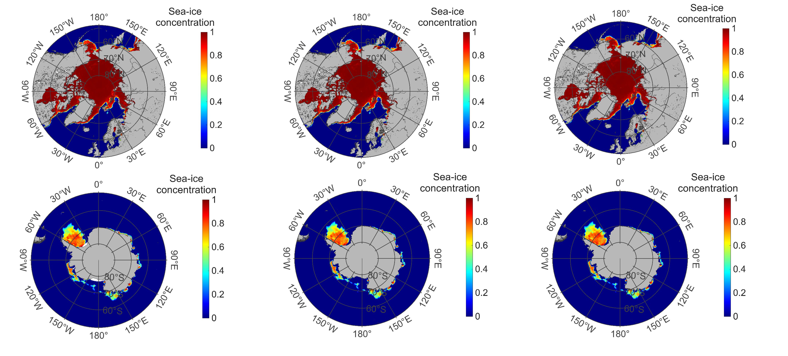
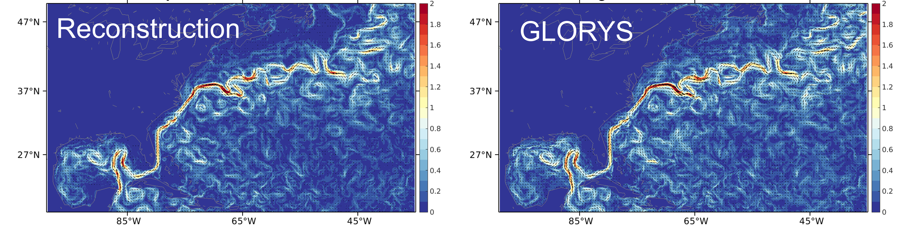
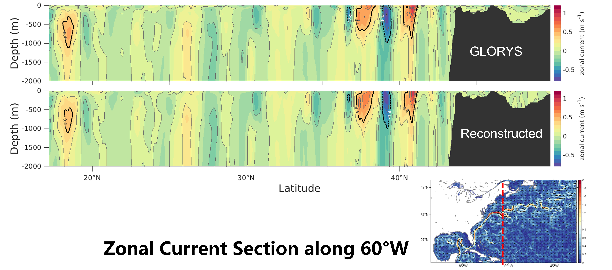
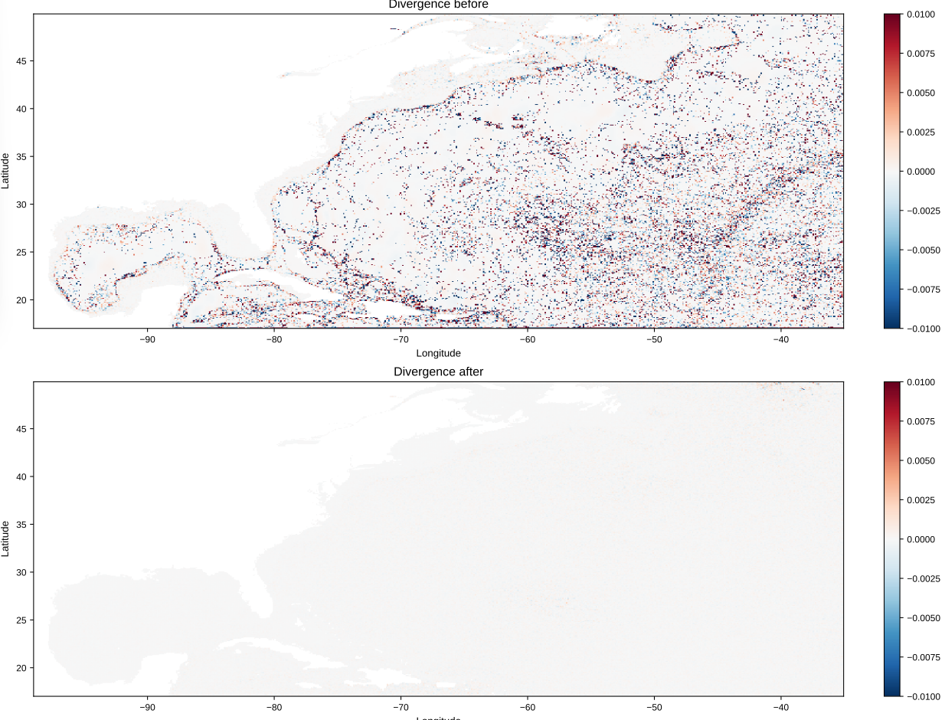
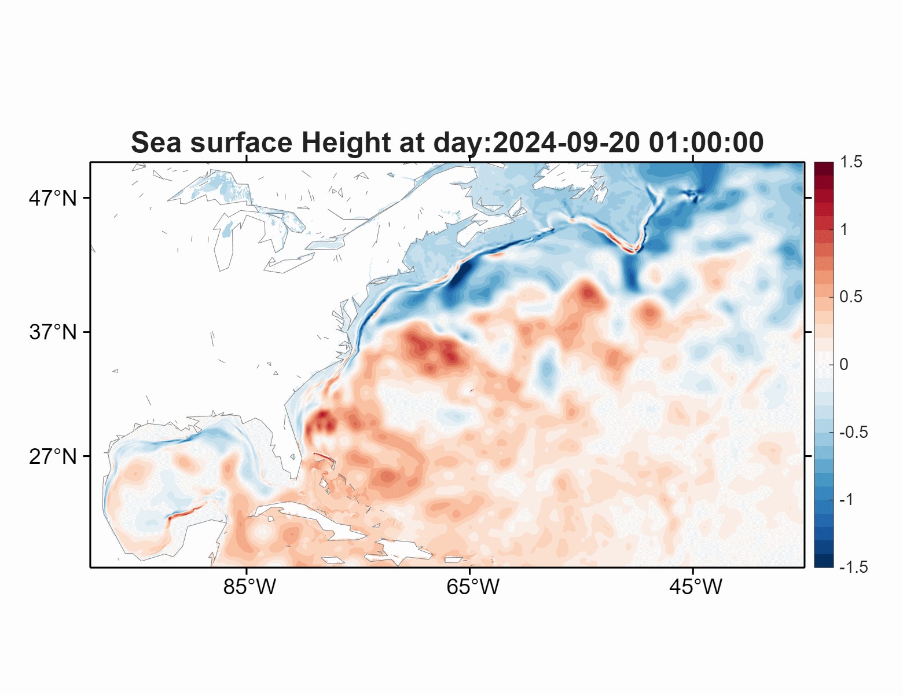
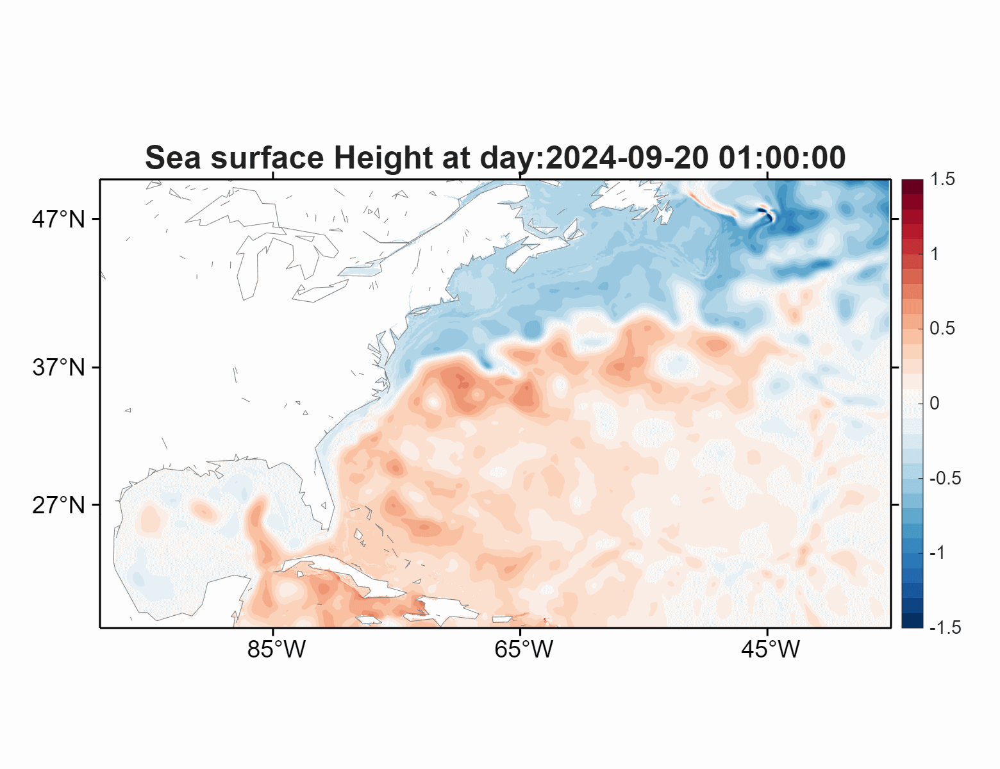

# MOM6 Initial and Open-Boundary Conditions

This repository prepares regional [MOM6](https://github.com/NOAA-GFDL/MOM6)
initial conditions (ICs) and open-boundary conditions (OBCs) from the
Copernicus Marine [**Global Ocean Physics Analysis and Forecast**](https://data.marine.copernicus.eu/product/GLOBAL_ANALYSISFORECAST_PHY_001_024/description) product. It
provides a workflow for downloading regional source fields, horizontally and
vertically remapping them to a MOM6 grid, and optionally reconstructing a
dynamically balanced three-dimensional current field.

The workflow can be used for both regional and global (tripolar) grids.

## Workflow

```text
Global Ocean Physics Analysis and Forecast
     |
     +--> Download regional source fields
     |
     +--> Horizontal and vertical remapping
     |       |
     |       +--> MOM6 initial condition
     |       |
     |       +--> MOM6 open-boundary conditions
     |
     +--> Optional geostrophic adjustment
             |
             +--> SSH-referenced surface current
             +--> Density and thermal-wind shear
             +--> Three-dimensional geostrophic current
             +--> Barotropic transport correction
             +--> Adjusted MOM6 initial condition
```

Initial-condition generation uses reusable horizontal-interpolation weights.
The first run is slower because the weight files must be generated and written.
For a C9600 grid (`6145 × 3169`), this normally takes about 15–20 minutes, depending on the memory available on the compute node running the script.
Later runs on the same source and target grids can read the existing weights
and usually complete in about 3 minutes.

## Sea-ice initialization

For coupled MOM6--SIS2 simulations, the workflow creates a two-dimensional
SIS2 initial-condition file from the daily CMEMS sea-ice analysis. The source
analysis and SIS2 describe ice thickness using related, but not identical,
quantities:

| Analysis data | Physical meaning | SIS2 initial condition |
|---|---|---|
| `siconc` | Fraction of the source grid cell covered by sea ice (0--1) | `aice`: total sea-ice concentration (0--1) |
| `sithick` | Mean thickness over the ice-covered part of the source grid cell (m) | `hm`: ice mass per unit ice-covered area (kg m<sup>-2</sup>) |

Because `sithick` is not a grid-cell mean thickness, it is not remapped
directly. Instead, the source grid-cell-equivalent ice volume is first formed
from concentration and ice thickness. Concentration and ice volume are then
remapped separately and conservatively to the MOM6/SIS2 tracer grid:

```math
\begin{aligned}
V_{\mathrm{ice}}^{\mathrm{src}}
  &= C^{\mathrm{src}} h_{\mathrm{ice}}^{\mathrm{src}}, \\
C^{\mathrm{dst}}
  &= \mathcal{R}\!\left(C^{\mathrm{src}}\right), \\
V_{\mathrm{ice}}^{\mathrm{dst}}
  &= \mathcal{R}\!\left(V_{\mathrm{ice}}^{\mathrm{src}}\right), \\
h_{\mathrm{ice}}^{\mathrm{dst}}
  &= \frac{V_{\mathrm{ice}}^{\mathrm{dst}}}{C^{\mathrm{dst}}}, \\
\mathrm{aice} &= C^{\mathrm{dst}}, \\
\mathrm{hm} &= \rho_{\mathrm{ice}} h_{\mathrm{ice}}^{\mathrm{dst}}.
\end{aligned}
```

Here, $\mathcal{R}$ is the conservative remapping operator and the default ice
density is $\rho_{\mathrm{ice}}=905\ \mathrm{kg\,m^{-3}}$. Remapped
concentrations below $10^{-6}$ are set to zero. Note that `hm` is the mass per
unit **ice-covered** area; the corresponding grid-cell-mean ice mass is
`aice * hm`.

<p align="center">
  
</p>

Sea-ice concentration in the Northern Hemisphere (top) and Southern
Hemisphere (bottom). From left to right: the original CMEMS analysis, the
field conservatively remapped to the MOM6/SIS2 grid, and the MOM6--SIS2
simulation.

## Geostrophic adjustment

### Motivation

Directly interpolating velocity from the source product onto a regional MOM6
C-grid does not guarantee dynamical consistency with the separately remapped
SSH, temperature, salinity, target bathymetry, wet mask, and horizontal grid
metrics. This imbalance can therefore be introduced by remapping itself. During
model spin-up, the ocean adjusts to the imbalance by producing spurious
barotropic gravity waves, whose influence can persist for approximately 6–10
hours.

From a practical forecasting perspective, when the ocean model is initialized from an external dataset, it is preferable to initialize the model from a dynamically balanced state to reduce the initialization shock. Otherwise, during the initial adjustment period, spurious gravity waves can cause the flow field to exhibit artificial oscillations. To mitigate this initialization shock, the geostrophic-adjustment module reconstructs the velocity field from the remapped mass fields and applies a depth-independent correction to reduce transport divergence on the target MOM6 grid. This adjustment prioritizes dynamical balance over the exact preservation of the source velocity field. It reconstructs the geostrophically balanced component but does not explicitly retain transient ageostrophic motions, such as wind-driven Ekman currents. These components are allowed to develop under the subsequent model forcing. If needed in future applications, they could be initialized using the recent wind-stress history and ocean boundary-layer structure, followed by appropriate boundary and transport-balance corrections on the target grid.

The Python implementation is actively maintained and is used by the current
workflow. The MATLAB implementation is retained temporarily as a reference
and will be gradually deprecated.

### Numerical procedure

1. **Density**

   In-situ density is calculated from potential temperature, salinity, and
   layer depth using the Jackett and McDougall equation of state in both code
   versions.

2. **SSH-referenced surface current**

   From the sea-surface height, the surface geostrophic current is derived as

   ```math
   \begin{aligned}
   u_g^{\mathrm{surf}}(x,y)
   &= -\frac{g}{f(x,y)}
      \frac{\partial\eta(x,y)}{\partial y}, \\
   v_g^{\mathrm{surf}}(x,y)
   &= \frac{g}{f(x,y)}
      \frac{\partial\eta(x,y)}{\partial x}.
   \end{aligned}
   ```

   Horizontal derivatives are evaluated with the real MOM6 distances derived
   from `ocean_hgrid.nc` and are masked across land.

3. **Thermal-wind shear**

   The vertical shear of the geostrophic current satisfies the thermal-wind
   equations:

   ```math
   \begin{aligned}
   \frac{\partial u_g}{\partial z}
   &= -\frac{g}{f(x,y)\rho_0}
      \frac{\partial\rho(T,S,z)}{\partial y}, \\
   \frac{\partial v_g}{\partial z}
   &= \frac{g}{f(x,y)\rho_0}
      \frac{\partial\rho(T,S,z)}{\partial x}.
   \end{aligned}
   ```

   Integrating these shears downward from the SSH-referenced surface current
   gives

   ```math
   \begin{aligned}
   u_g(x,y,z)
   &= u_g^{\mathrm{surf}}(x,y)
      + \int_0^z
      \left[
      -\frac{g}{f(x,y)\rho_0}
      \frac{\partial\rho(T,S,z')}{\partial y}
      \right]\,dz', \\
   v_g(x,y,z)
   &= v_g^{\mathrm{surf}}(x,y)
      + \int_0^z
      \left[
      \frac{g}{f(x,y)\rho_0}
      \frac{\partial\rho(T,S,z')}{\partial x}
      \right]\,dz'.
   \end{aligned}
   ```

   Here, z′ is the vertical integration coordinate, while z is the target
   depth at which the geostrophic current is evaluated.

   The ocean mask and water depth are applied at every level so that currents
   are calculated only in the ocean and above the seafloor.

4. **Depth-integrated transport correction**

   Whether velocity is directly remapped or geostrophically reconstructed,
   its depth-integrated transport on the target grid can contain a residual
   divergence. Remapping alone can produce this problem because it does not
   exactly preserve the source-grid barotropic continuity constraint:

   ```math
   \mathbf{M}
   = \int_{-H}^{0}\mathbf{u}\,dz,
   \qquad
   D = \nabla\cdot\mathbf{M} \ne 0.
   ```

   A scalar potential, χ, is then obtained from a Poisson equation. Its
   gradient provides a depth-independent velocity correction that removes
   this residual divergence:

   ```math
   \begin{aligned}
   \nabla\cdot(H\nabla\chi) &= -D, \\
   \mathbf{u}_{\mathrm{adjusted}}
   &= \mathbf{u}+\nabla\chi, \\
   \nabla\cdot
   \int_{-H}^{0}\mathbf{u}_{\mathrm{adjusted}}\,dz
   &\approx 0.
   \end{aligned}
   ```

   The Python implementation solves the symmetric finite-volume Poisson
   system with conjugate gradients preconditioned by a PyAMG multigrid
   V-cycle. Install PyAMG in the active Conda environment with:

   ```bash
   conda install -c conda-forge pyamg
   ```

   The transport-divergence correction is optional. Before running `MODE=4`,
   set the following option in `prepare_regional_MOM6_inputs.sh` or
   `prepare_global_MOM6_inputs.sh`:

   ```bash
   APPLY_BAROTROPIC_CORRECTION="true"   # Apply the correction
   APPLY_BAROTROPIC_CORRECTION="false"  # Skip the correction
   ```

   PyAMG is required only when this option is `"true"`. The adjusted NetCDF
   file is published only after the iterative solver converges and the
   applied correction is verified against the Poisson operator.

### Example results

The surface-current comparison shows that the reconstruction preserves the
full pathway and major spatial structure of the Gulf Stream.

<p align="center">
  
</p>

The zonal-current section shows that the reconstruction preserves the major
vertical current structures present in the source product.

<p align="center">
  
</p>

The barotropic correction substantially reduces the depth-integrated
transport divergence. This improves consistency with volume conservation and
makes the initial current field more dynamically balanced.

<p align="center">
  
</p>


The animations compare the simulated sea-surface-height evolution initialized from the directly
interpolated and reconstructed velocity fields. The reconstructed currents
mitigate the initialization shock, especially in regions with strong
sea surface height gradients, where the spurious barotropic gravity wave
signal is most apparent.

<table>
  <tr>
    <th>Initialized from original IC</th>
    <th>Initialized from reconstructed IC</th>
  </tr>
  <tr>
    <td></td>
    <td></td>
  </tr>
</table>


## Running the workflow

Before running this workflow, clone `HCtFlood` into the
`MOM_ICs_OBCs/scripts/` directory. This tool is used to fill land grid
points with valid values.

```bash
git clone https://github.com/raphaeldussin/HCtFlood.git MOM_ICs_OBCs/scripts/HCtFlood
```

### Batch processing

For batch processing, configure the dates, initialization hours, resolution,
vertical levels, boundary duration, and geostrophic-adjustment switch in
`Generating_MOM6_IC_OBCs.csh`. In the same script, specify
`prepare_regional_MOM6_inputs.sh` for regional applications or
`prepare_global_MOM6_inputs.sh` for global applications. Then run:

```csh
./Generating_MOM6_IC_OBCs.csh
```

### Manual processing

Run a selected processing stage directly using the appropriate script:

For a regional configuration:

```bash
./prepare_regional_MOM6_inputs.sh START_DATE START_HOUR END_DATE MODE
```

`MODE` selects the processing stage:

| `MODE` | Processing stage |
|---:|---|
| `1` | Download source data |
| `2` | Generate an initial condition |
| `3` | Generate open-boundary conditions |
| `4` | Reconstruct geostrophic currents from an existing initial condition |
| `all` | Run modes 1–3 in sequence; mode 4 is not included |

Examples:

```bash
# Download cropped Global Ocean Physics Analysis and Forecast data
./prepare_regional_MOM6_inputs.sh 2022-11-28 12 2022-12-01 1

# Generate one initial condition
./prepare_regional_MOM6_inputs.sh 2022-11-28 12 2022-11-28 2

# Generate open-boundary conditions over a date range
./prepare_regional_MOM6_inputs.sh 2022-11-28 12 2022-12-01 3

# Reconstruct geostrophic currents for an existing initial condition
./prepare_regional_MOM6_inputs.sh 2022-11-28 12 2022-11-28 4
```

For a global configuration, open boundary conditions are not required.
Therefore, only `MODE=1`, `MODE=2`, and `MODE=4` or `MODE=all` are needed:

```bash
./prepare_global_MOM6_inputs.sh START_DATE START_HOUR END_DATE MODE
```
Examples:

```bash
# Download Global Ocean Physics Analysis and Forecast data
./prepare_global_MOM6_inputs.sh 2022-11-28 12 2022-12-01 1

# Generate one initial condition
./prepare_global_MOM6_inputs.sh 2022-11-28 12 2022-11-28 2

# Reconstruct geostrophic currents for an existing initial condition
./prepare_global_MOM6_inputs.sh 2022-11-28 12 2022-11-28 4
```
## Grid and source data

The **grid** directory for each resolution should contain:

```text
grid/<resolution>/
├── ocean_hgrid.nc
├── ocean_mask.nc
├── topog.nc
└── vgrid_NK85.nc
```

The source fields obtained from the **Global Ocean Physics Analysis and
Forecast** product are:

- potential temperature (`thetao`);
- salinity (`so`);
- zonal and meridional velocity (`uo`, `vo`);
- sea-surface height;
- sea-ice concentration (`siconc`);
- sea-ice thickness (`sithick`).

## Repository layout

```text
MOM_ICs_OBCs/scripts/
├── download/
├── initial/
├── boundary/
├── HCtFlood/ 
├── geostrophic_adj/
│                  ├── matlab/
│                  └── python/
├── prepare_regional_MOM6_inputs.sh
├── prepare_global_MOM6_inputs.sh
└── Generating_MOM6_IC_OBCs.csh
```

## Example outputs

```text
ICs/C3200/NK85/MOM6_IC_2022112812_C3200.nc
ICs/C3200/NK85/MOM6_IC_2022112812_C3200_geocurrents.nc
ICs/C3200/NK85/SIS2_IC_2022112812_C3200.nc
OBCs/C3200/NK85/2022112812/thetao_001.nc
OBCs/C3200/NK85/2022112812/so_001.nc
OBCs/C3200/NK85/2022112812/zos_001.nc
OBCs/C3200/NK85/2022112812/uv_001.nc
```

## Acknowledgements

Workflow development and geostrophic-adjustment integration: **Dr Biao Zhao**. The IC and OBC preparation workflow adapted the Python processing scripts developed by **Dr. Jing Chen**.
